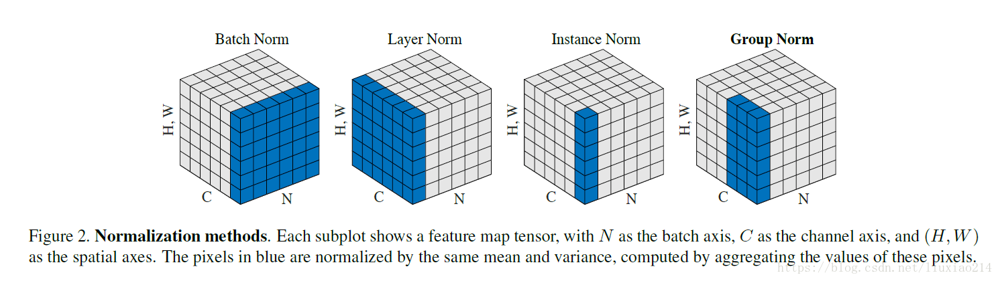
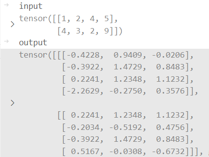
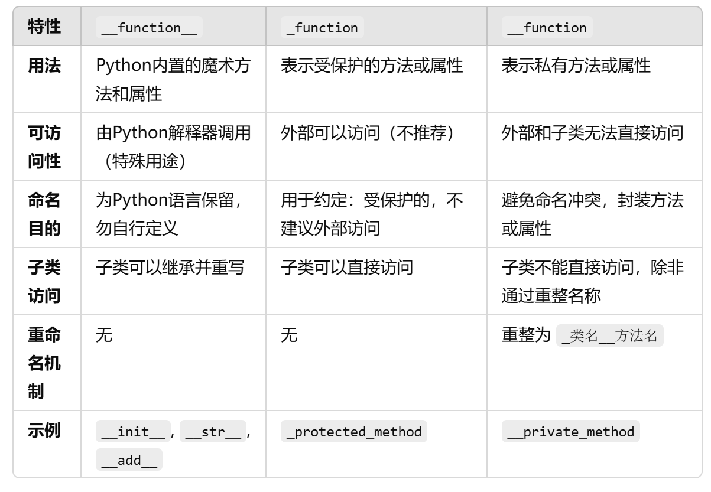

# 基础知识
#### SGCS和GCS的区别
+ GCS: Generalized Cosine Similarity
$$

$$
+ SGCS: Squared Generalized Cosine Similarity
$$
SGCS(W, W') = \frac{1}{N_{sample}N_{sb}}\sum_{i=1}^{N_{sample}}\sum_{k=1}^{N_{sb}}(\frac{||w_{k,i}^Hw'_{k,i}||_2}{||w_{k,i}||_2||w'_{k,i}||_2})^2
$$

#### transformer的input 和 output
+ input: **(batch_size, seq_dim, words_dim)**
+ output: **(batch_size, seq_dim, words_dim)**

Batch Normalization 和 Layer Normalization的区别

+ Batch Normalization 是对Batch做的平均 --他一个batch的数据长度是固定的
+ Layer Normalization 是在在每一个Batch里做平均 --batch中的统计量可能是不等长的

#### nn.embedding
torch.nn.Embedding(num_embeddings, embedding_dim, padding_idx=None, max_norm=None, norm_type=2.0, scale_grad_by_freq=False, sparse=False, _weight=None, _freeze=False, device=None, dtype=None)

num_embeddings (int) – size of the dictionary of embeddings -共有多少个词(词库大小)

embedding_dim (int) – the size of each embedding vector -embedding后的词向量的维度
+ 初衷输入是(B, L)的one-hot编码, 每一个元素就是一个整数代表着一个着一个单词编码[0, num_embeddings - 1]
+ 基于上述输入, 把L个单词embedding成 embedding_dim维度的词向量

#### 在子类调用父类函数的两种办法
+ 把父类的函数定义为静态方法@staticmethod,这样的定义不依赖于实例的数据,访问更加随意
+ 父类的函数绑定self,子类调用时self.function
  + 但是!子类不能直接访问父类的私有方法
#### python方法命名的不同意义
